# Architecture Analysis Report

_Generated by Archiscape_

## Overview

- **Project:** /home/illy/openended/archiscape
- **Components:** 62
- **Dependencies:** 52
- **Communities:** 11
- **Graph Density:** 0.0137

## Architecture Smells

| Type | Component | Score | Message |
|------|-----------|-------|---------|
| broadcast_dependency | `archiscape.cli` | 6.44 | Excessive imports (22 dependencies) — possible responsibility overload |
| isolated_component | `archiscape` | 3.33 | No dependencies in either direction — possibly dead code |
| isolated_component | `archiscape.__main__` | 3.33 | No dependencies in either direction — possibly dead code |
| isolated_component | `archiscape.renderers` | 3.33 | No dependencies in either direction — possibly dead code |
| orphan_module | `archiscape.renderers.html` | 2.33 | Only one connection — may be misplaced or redundant |

## Layer Distribution

| Layer | Count | % |
|-------|-------|---|
| analysis | 28 | 45% |
| other | 15 | 24% |
| presentation | 9 | 15% |
| rendering | 7 | 11% |
| infrastructure | 2 | 3% |
| domain | 1 | 2% |

## Top Hubs

| Component | Degree | Fan-in | Fan-out | Layer |
|-----------|--------|--------|---------|-------|
| archiscape.graph | 9 | 0 | 9 | analysis |
| archiscape.smells | 9 | 0 | 9 | other |
| archiscape.cli | 8 | 0 | 8 | presentation |
| archiscape.exporters | 8 | 0 | 8 | other |
| archiscape.analyzer | 4 | 0 | 4 | analysis |
| archiscape.renderers.markdown | 2 | 0 | 2 | rendering |

## Dependency Graph (Mermaid)

```mermaid
graph TD

    archiscape[archiscape]
    style archiscape fill:#f5f5f5,stroke:#616161
    archiscape___main__[archiscape.__main__]
    style archiscape___main__ fill:#f5f5f5,stroke:#616161
    archiscape_analyzer[archiscape.analyzer]
    style archiscape_analyzer fill:#e1bee7,stroke:#4a148c
    archiscape_analyzer_CodeEntity(CodeEntity)
    archiscape_analyzer_CodeEntity___init__[__init__]
    archiscape_analyzer_CodeEntity_full_name[full_name]
    archiscape_analyzer_CodeEntity_module_path[module_path]
    archiscape_analyzer_CodeEntity_to_dict[to_dict]
    archiscape_analyzer_classify_import[classify_import]
    archiscape_analyzer__should_skip[_should_skip]
    archiscape_analyzer_Analyzer(Analyzer)
    archiscape_analyzer_Analyzer___init__[__init__]
    archiscape_analyzer_Analyzer_scan[scan]
    archiscape_analyzer_Analyzer__find_readme[_find_readme]
    archiscape_analyzer_Analyzer__analyze_file[_analyze_file]
    archiscape_analyzer_Analyzer__extract_imports[_extract_imports]
    archiscape_analyzer_Analyzer__extract_entity[_extract_entity]
    archiscape_analyzer_Analyzer__build_report[_build_report]
    archiscape_cli[archiscape.cli]
    style archiscape_cli fill:#ffcccc,stroke:#b71c1c
    archiscape_cli_scan[scan]
    archiscape_cli_doc[doc]
    archiscape_cli_summary[summary]
    archiscape_cli_smells[smells]
    archiscape_cli__analyze[_analyze]
    archiscape_cli__print_summary[_print_summary]
    archiscape_cli__print_hubs[_print_hubs]
    archiscape_cli_main[main]
    archiscape_exporters[archiscape.exporters]
    style archiscape_exporters fill:#f5f5f5,stroke:#616161
    archiscape_exporters__graphml_clean[_graphml_clean]
    archiscape_exporters_export_graphml[export_graphml]
    archiscape_exporters_export_mermaid[export_mermaid]
    archiscape_exporters_export_markdown_architecture_report[export_markdown_architecture_report]
    archiscape_exporters__get_networkx[_get_networkx]
    archiscape_exporters__mermaid_id[_mermaid_id]
    archiscape_exporters__layer_fill[_layer_fill]
    archiscape_exporters__layer_stroke[_layer_stroke]
    archiscape_graph[archiscape.graph]
    style archiscape_graph fill:#e1bee7,stroke:#4a148c
    archiscape_graph_detect_layer_heuristic[detect_layer_heuristic]
    archiscape_graph_classify_with_llm[classify_with_llm]
    archiscape_graph_generate_llm_narrative[generate_llm_narrative]
    archiscape_graph_build_graph[build_graph]
    archiscape_graph__collect_names[_collect_names]
    archiscape_graph__collect_children[_collect_children]
    archiscape_graph__resolve_import_target[_resolve_import_target]
    archiscape_graph_detect_communities[detect_communities]
    archiscape_graph_compute_metrics[compute_metrics]
    archiscape_renderers[archiscape.renderers]
    style archiscape_renderers fill:#f8bbd0,stroke:#880e4f
    archiscape_renderers_html[archiscape.renderers.html]
    style archiscape_renderers_html fill:#f8bbd0,stroke:#880e4f
    archiscape_renderers_html_generate_html[generate_html]
    archiscape_renderers_markdown[archiscape.renderers.markdown]
    style archiscape_renderers_markdown fill:#f8bbd0,stroke:#880e4f
    archiscape_renderers_markdown_generate_markdown[generate_markdown]
    archiscape_renderers_markdown__render_module[_render_module]
    archiscape_smells[archiscape.smells]
    style archiscape_smells fill:#f5f5f5,stroke:#616161
    archiscape_smells_detect_smells[detect_smells]
    archiscape_smells__score[_score]
    archiscape_smells__detect_god_modules[_detect_god_modules]
    archiscape_smells__detect_circular_dependencies[_detect_circular_dependencies]
    archiscape_smells__detect_unstable_interfaces[_detect_unstable_interfaces]
    archiscape_smells__detect_dense_coupling[_detect_dense_coupling]
    archiscape_smells__detect_isolated_components[_detect_isolated_components]
    archiscape_smells__detect_documentation_debt[_detect_documentation_debt]
    archiscape_smells__detect_broadcast_dependencies[_detect_broadcast_dependencies]
    archiscape_analyzer -.-> archiscape_analyzer_CodeEntity
    archiscape_analyzer -.-> archiscape_analyzer_classify_import
    archiscape_analyzer -.-> archiscape_analyzer__should_skip
    archiscape_analyzer -.-> archiscape_analyzer_Analyzer
    archiscape_analyzer_CodeEntity -.-> archiscape_analyzer_CodeEntity___init__
    archiscape_analyzer_CodeEntity -.-> archiscape_analyzer_CodeEntity_full_name
    archiscape_analyzer_CodeEntity -.-> archiscape_analyzer_CodeEntity_module_path
    archiscape_analyzer_CodeEntity -.-> archiscape_analyzer_CodeEntity_to_dict
    archiscape_analyzer_Analyzer -.-> archiscape_analyzer_Analyzer___init__
    archiscape_analyzer_Analyzer -.-> archiscape_analyzer_Analyzer_scan
    archiscape_analyzer_Analyzer -.-> archiscape_analyzer_Analyzer__find_readme
    archiscape_analyzer_Analyzer -.-> archiscape_analyzer_Analyzer__analyze_file
    archiscape_analyzer_Analyzer -.-> archiscape_analyzer_Analyzer__extract_imports
    archiscape_analyzer_Analyzer -.-> archiscape_analyzer_Analyzer__extract_entity
    archiscape_analyzer_Analyzer -.-> archiscape_analyzer_Analyzer__build_report
    archiscape_cli -.-> archiscape_cli_scan
    archiscape_cli -.-> archiscape_cli_doc
    archiscape_cli -.-> archiscape_cli_summary
    archiscape_cli -.-> archiscape_cli_smells
    archiscape_cli -.-> archiscape_cli__analyze
    archiscape_cli -.-> archiscape_cli__print_summary
    archiscape_cli -.-> archiscape_cli__print_hubs
    archiscape_cli -.-> archiscape_cli_main
    archiscape_exporters -.-> archiscape_exporters__graphml_clean
    archiscape_exporters -.-> archiscape_exporters_export_graphml
    archiscape_exporters -.-> archiscape_exporters_export_mermaid
    archiscape_exporters -.-> archiscape_exporters_export_markdown_architecture_report
    archiscape_exporters -.-> archiscape_exporters__get_networkx
    archiscape_exporters -.-> archiscape_exporters__mermaid_id
    archiscape_exporters -.-> archiscape_exporters__layer_fill
    archiscape_exporters -.-> archiscape_exporters__layer_stroke
    archiscape_graph -.-> archiscape_graph_detect_layer_heuristic
    archiscape_graph -.-> archiscape_graph_classify_with_llm
    archiscape_graph -.-> archiscape_graph_generate_llm_narrative
    archiscape_graph -.-> archiscape_graph_build_graph
    archiscape_graph -.-> archiscape_graph__collect_names
    archiscape_graph -.-> archiscape_graph__collect_children
    archiscape_graph -.-> archiscape_graph__resolve_import_target
    archiscape_graph -.-> archiscape_graph_detect_communities
    archiscape_graph -.-> archiscape_graph_compute_metrics
    archiscape_renderers_html -.-> archiscape_renderers_html_generate_html
    archiscape_renderers_markdown -.-> archiscape_renderers_markdown_generate_markdown
    archiscape_renderers_markdown -.-> archiscape_renderers_markdown__render_module
    archiscape_smells -.-> archiscape_smells_detect_smells
    archiscape_smells -.-> archiscape_smells__score
    archiscape_smells -.-> archiscape_smells__detect_god_modules
    archiscape_smells -.-> archiscape_smells__detect_circular_dependencies
    archiscape_smells -.-> archiscape_smells__detect_unstable_interfaces
    archiscape_smells -.-> archiscape_smells__detect_dense_coupling
    archiscape_smells -.-> archiscape_smells__detect_isolated_components
    archiscape_smells -.-> archiscape_smells__detect_documentation_debt
    archiscape_smells -.-> archiscape_smells__detect_broadcast_dependencies
```

